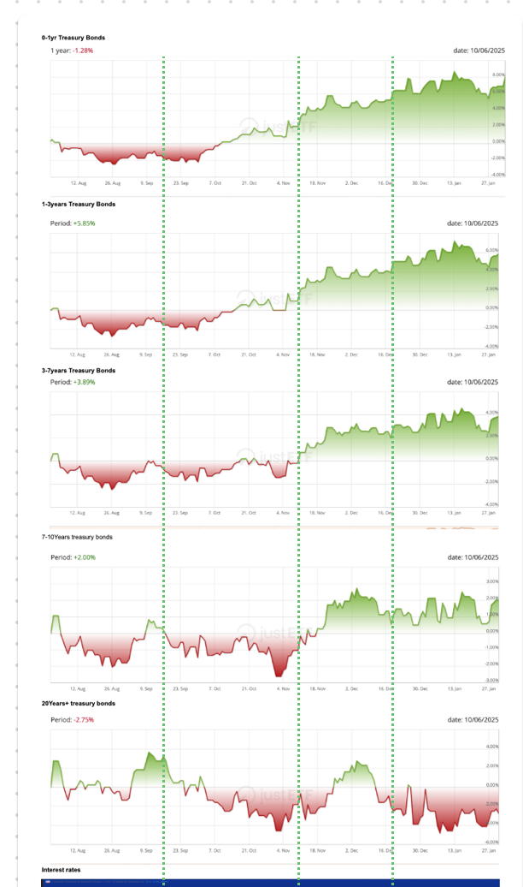

# Q3 investment Outlook

### YTD Fund performance:
 

#### Holdings
| Stock      | Status | Description |
| ----------- | ----------- | ---- |
| VPU      | SOLD       | Vanguard Utilities Index Fund ETF |
| VDC   | SOLD        | Vanguard Consumer Staples Index Fund ETF |
| VHT   | SOLD        | Vanguard Health Care Index Fund ETF |
| PPA   | SOLD        | Invesco Aerospace & Defense ETF |
| EIB Corp 8.75 Aug18'25    | BOUGHT        | European Investment Bank (EIB) |

In December last year, while people were still caught in the post-election blues, I anticipated that tariff talks would begin soon in January. I also believed that AI stocks were overinflated, and that eventually people would realize the current ratio of usefulness to billion-dollar GPU acquisitions leaned more toward an operational cost problem than a true innovation bottleneck. Everyone wanted more powerful GPUs without truly optimizing their models to run efficiently on existing hardware.

At the time, AI-related stocks made up over one-third of the S&P 500, so I had already begun reducing my exposure by shifting toward broader market coverage via VTI, rather than maintaining concentrated exposure to what I saw as an AI bubble. By December 2024, I wanted to de-risk even further. I anticipated that Trump’s proposed tariffs would push the U.S. economy toward a recession—not inflation, which was what everyone else seemed focused on.

I repositioned my portfolio into defensive sectors (utilities, consumer staples, healthcare, and defense), which tend to perform well during recessions. And come January 2025, that shift paid off. By the end of Q1 2025, I had sold those positions and locked in a 3–4% gain. Honestly, anyone making 3–4% this year should feel good about it.

Wanting to minimize my equity exposure even further, I started exploring bonds—assets that typically offer a defined return by a fixed maturity date. Think of it as lending someone money and getting it back at maturity with interest. I came across an EIB bond denominated in ZAR. At the time, I wasn’t overly concerned about foreign currency volatility; my goal was simply to reduce both equity exposure and dependency on USD cash reserves, especially with Trump’s plan likely involving a weaker dollar to boost U.S. exports.

The EIB bond offered a 2.9% return at maturity in August—decent for about six months, especially given its high credit rating. For me, that was a no-brainer.

### Macro Economic Overview

- **Inflation**: Inflation numbers have stabilised and core inflation readings are consistently cooled, suggesting Fed's rate hike 2022-2023 have achieved their desired effect. Last month Fed also implementing slowing down quantitative tightening (QT) which mean they do not want the money supply to get reduced too fast - and by extension an attempt at controlling deflation instead of inflation. 
- **Tariffs impact lag**: The tariffs caused a lot of companies to stock up, the impact have not yet have a full cycle to inflation data but are adding to supply side pressures. Part of Trump plan is to make american exports competitive and he cannot do that without purposely devaluing the USD. 
- **Recession**: The US GDP in the first quarter contracted by 0.3%.  I expect Q2 2025 GDP data to confirm a 2nd consecutive quarter of negative growth - which is the economist's definition of a recession. While noone has been saying the R word for now, i expect news and media to overblow and overuse it once GDP data for Q2 are out, which would fuel a panic and add to more uncertainty. 
- **Labor market layoffs**: while job numbers are now starting to reflect layoffs, everyone knows and have noticed that since beginning of this year there have been more and more layoffs.
- **One Big Beautiful Bill**:  Concerns over US rising debt when the 1BBB gets introduce could affect long term bonds as it would drive up the term premiums as it has been doing since the past year.

### Federal Reserve Outlook
Inflation numbers (2.3% trailing 12months ending April) are meeting Fed's 2% target and they have now acknowledge that a recession is very likely. So they have a room for operation in cutting interest rates and they will do such as late as possible and in typical fashion - after the fact i.e once everyone starts to panic sell. It might be as soon as next month for next quarter or later this year. But one thing is for sure imo, they are not gonna increase interest rates. 

### Market Expectations

-	I expect a short-term correction or renewed volatility around the Q2 GDP release.
-	Equity markets are going to continue to fall, as employement rates are trending downwards. (Less people working on making stuffs = less stuffs = less profit = less GDP)
-	Bond yields will begin to fall in anticipation of rate cuts → this benefits existing bondholders through capital appreciation.
-	The Federal reserve are going to gradualy cut interest rates to stimulate the economy
-	US Dollar is going to depreciate for more competitive pricing of American Exports

### Portfolio Strategy going into Q3 2025
I’ll be focusing more on capital preservation while trying to profit from potential bond price appreciation as interest rates are expected to fall or remain stable.

I have a few options on the table. One thing I didn’t particularly enjoy despite the returns was holding the EIB bond because of the lack of liquidity — if an opportunity comes, i don't have the enough funds to capitalise on it. 

Right now, bond yields and money market fund returns are fairly close, so it makes sense to consider more liquid options.

##### Money Market – VMFXX

The Vanguard Federal Money Market Fund (VMFXX) is essentially cash with yield. It’s one of the lowest-risk vehicles available:
-	It maintains a constant NAV of $1.00, ensuring price stability.
-	Yields fluctuate with the Fed interest rate — currently at around 4.67%.
-	Ideal for capital preservation with minor appreciation from current high interest rates.

##### Bonds – BND

Then there’s Vanguard Total Bond Market ETF (BND):
	•	Offers broad exposure to U.S. investment-grade bonds.
	•	Pays monthly dividends based on bond yields.
	•	If interest rates drop, bond prices rise, potentially increasing BND’s NAV.

##### Taxation Issue as a Mauritian Investor

Here comes my issue: as a Mauritian investor, I am subject to a 30% U.S. withholding tax on dividends from U.S.-domiciled funds.
I wouldn’t mind paying 15% if there were a U.S.-Mauritius tax treaty — but unfortunately, none exists.

Which is pushing me to come up with some creative strategies:
1.	Ireland-Domiciled ETFs:
	-	Funds based in Ireland benefit from the U.S.-Ireland tax treaty, reducing withholding tax on U.S-source income to 15%.
	-	Example: iShares Core Global Aggregate Bond UCITS ETF (AGGG) or other bond ETFs with similar exposure to BND.
2.	Accumulating Share Classes:
	-	Instead of receiving taxable dividend payouts, these reinvest dividends internally, increasing the NAV.
	-	As a result, no dividend tax is incurred until you sell the ETF, depending on your jurisdiction’s capital gains tax rules.

##### Bond price performance from interest rate changes.:

I've compile a chart for the short term, medium terms, and long term bond price performance from interest rate changes.
The short term interest rates have been performing better than long term in 2024, as: 
1. Inflation risks were still present
2. Fiscal concerns about US Debt and election uncertainty
3. as such Investors needed more yields to stay in long term bonds = driving bond prices stable or even decreasingly.

###### MACRO OUTLOOK SUMMARY
Current Environment (June 2025)
- CPI near 2% → Fed has breathing room.
- Rate cuts possible, but Fed might move slowly unless GDP craters.
- Q2 GDP might confirm technical recession.
- US debt/fiscal concerns could push term premiums up, hurting long-duration.
- Market volatility likely to increase.

###### Treasury bonds allocation:
| Bond      | Allocation | Description |
| ----------- | ----------- | ---- |
| 0-1 year treasury bonds      | 30%       | Stability, liquidity, yield ~5% now |
| 3-7 year treasury bonds   | 40%        | Sweet spot for rate-cut upside vs volatility |
| 20 years+ treasury bonds   | 40%        | Big upside if recession deepens or Fed slashes rates unexpectedly |

This allocation would mitigate the some risks relating to term premiums, or if fed desides to have a slow rate cut.
For more aggressive allocation i'd shift to increasing weight on long and mid term bonds and do the opposite for risk adversity.

###### Treasury bonds instruments:
We are looking into Accumulating etfs that are irish-domicile for tax efficiency:

| Bond      | Allocation |
| ----------- | ----------- |
| 0-1 year treasury bonds | iShares USD Treasury Bond 0-1yr UCITS ETF (Acc): **IBC1**|
| 3-7 year treasury bonds | iShares USD Treasury Bond 3-7yr UCITS ETF (Acc): **SXRL**|
| 20 years+ treasury bonds | iShares USD Treasury Bond 20+yr UCITS ETF USD (Acc): **SXRC**|

##### Additional risk mitigation
A more sophisticated portfolio i think would incorporate more asset classes such as: gold/commodities, defensive ETFs, Money Market Funds/ Cash.
But from my end I am happy to be slightly more aggressive and have an all bond portfolio which has a good blend of short, med, long term bonds. 

